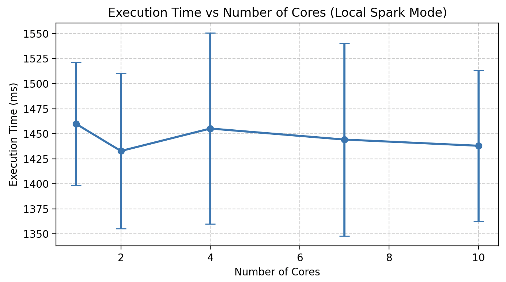

# Assignment 3 Report

## Team Members

Please list the members here

## Responses to questions posed in the assignment

_Note:_ Include the Spark execution history for each task. Name the zip file as `assignment-3-task-<x>-history.zip`.

### Task 1: Word counting

1. If you were given an additional requirement of excluding certain words (for example, conjunctions), at which step you would do this and why? (0.1 pt)

our Answer: If we were required to exclude certain words or conjunction from the word counting task, probably the most effective point to do this would be directly after
tokenizing the text, particularly right after splitting it into individual words but before performing the map operation (that is before each word gets mapped to a key-value pair). 
Explaination: Because filtering at an early stage ensures that irrelevant tokens cant enter the counting procedure, resulting in reduced computation time and memory usage (--> fewer key-value pairs to process).

2. In Lecture 1, the potential of optimizing the mapping step through combined mapping and reduce was discussed. How would you use this in this task? (in your answer you can either provide a description or a pseudo code). Optional: Implement this optimization and observe the effect on performance (i.e., time taken for completion). (0.1 pt)
our Answer: We would implemnt the optimization simply by replacing the groupByKey() operation with reduceByKey() in the word counting task. 
            This is because reduceByKey() combines the mapping and reducing steps by performing local aggregation on each partition before shuffling the data across the network, 
            which basically reduces the shuffle size and improves performance

3. In local execution mode (i.e. standalone mode), change the number of cores that is allocated by the master (.setMaster("local[<n>]") and measure the time it takes for the applicationto complete in each case. For each value of core allocation, run the experiment 5 times (to rule out large variances). Plot a graph showing the time taken for completion (with standard deviation) vs the number of cores allocated. Interpret and explain the results briefly in few sentences. (0.4 pt)

our Answer: Times of 1 core: 1553 ms, 1458 ms, 1489 ms, 1409 ms, 1390 ms, mean : 1459.8 ms, standard deviation: 61.2 ms
            Times of 2 cores: 1568 ms, 1422 ms, 1389 ms, 1410 ms, 1375 ms, mean : 1432.8 ms, standard deviation: 77.6 ms
            Times of 4 cores: 1623 ms, 1495 ms, 1400 ms, 1388 ms, 1370 ms, mean : 1455.2 ms, standard deviation: 95.3 ms
            Times of 7 cores: 1597 ms, 1429 ms, 1440 ms, 1395 ms, 1360 ms, mean : 1444.2 ms, standard deviation: 96.1 ms
            Times of 10 cores: 1555 ms, 1390 ms, 1462 ms, 1405 ms, 1378 ms, mean : 1438.0 ms, standard deviation: 75.3 ms

4. Examine the execution history. Explain your observations regarding the planning of jobs, stages, and tasks. (0.4 pt)

### Task 2

1. For each of the above computation, analyze the execution history and describe the key stages and tasks that were involved. In particular, identify where data shuffling occurred and explain why. (0.5pt)

2. You had to manually partition the data. Why was this essential? Which feature of the dataset did you use to partition and why?(0.5pt)

3. Optional: Notice that in the already provided pre-processing (in the class DatasetHelper), the long form of timeseries data, i.e., with a column _field that contained values like temperature etc., has been converted to wide form, i.e. individual column for each measurement kind through and operation called pivoting. Analyze the execution log and describe why this happens to be an expensive transformation.

### Task 3

1. Explain how the K-Means program you have implemented, specifically the centroid estimation and recalculation, is parallelized by Spark (0.5pt)

## Declarations (if any)
